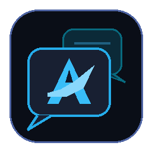

# Antigravity Conversation Manager

<p align="center">
  
</p>

Manage, organize, switch, move, export, import, and backup Google Antigravity conversations across Visual Studio Code, Antigravity IDE, and Cursor.

---

## Overview

**Antigravity Conversation Manager** provides a dedicated management hub for Google Antigravity conversation sessions. It solves the common challenges of organizing conversations across workspace projects, moving discussions when switching repositories, sharing portable session bundles, and safely backing up conversation databases.

### Compatibility
- **Editors**: Visual Studio Code, Google Antigravity Standalone IDE, Cursor, and other VS Code-compatible editors.
- **Antigravity Extension**: Official Google Antigravity extension `1.3.0+`, AGY backend `1.2.2+`.
- **Platforms**: Windows, macOS, Linux.

---

## Features

### Conversation Management & Switching
- **Workspace Tree View**: Browse all your Antigravity conversations grouped by project folders.
- **Active Session Indicator**: Distinct visual badge marking the currently active conversation in your editor.
- **One-Click Switch**: Switch active conversations with an in-webview confirmation modal without restarting the IDE.
- **Inline Renaming**: Rename conversations on the fly with immediate database synchronization.
- **Project Reordering**: Move project folders up and down to organize your workspace hierarchy.

### Migration & Relocation
- **Move Conversations Between Projects**: Reassign any conversation from one project workspace to another with a single click.
- **Safe Relocation**: Automated database snapshot backup prior to executing moves.

### Portable Export & Import
- **Portable Bundle (`.acm`)**: Export conversations into self-contained portable archives (including SQLite steps database, trajectory metadata, brain logs, and artifacts).
- **Human-Readable Markdown (`.md`)**: Export conversations as cleanly structured Markdown documents complete with prompts, thought chains, model responses, and tool calls.
- **Bundle Import**: Import conversation bundles directly into any target project workspace.

### Database Snapshot & Rollback
- **Point-in-Time Backups**: Take full snapshot backups of Antigravity's conversation database (`conversation_summaries.db`) and trajectory databases.
- **Rollback & Restore**: Easily restore databases from earlier snapshots with safe WAL checkpointing.

### Editor Integration & Status Bar
- **Antigravity Logo Status Bar Item**: Live conversation counter with custom Antigravity font branding.
- **Search & Filter**: Real-time instant search across conversation titles and preview text.
- **Consistent Design System**: Shares the same unified `--ag-*` design tokens, dialogs, and slim scrollbars as Antigravity Account Switcher.

---

## Commands

All commands are accessible from the Command Palette (`Ctrl+Shift+P` / `Cmd+Shift+P`):

| Command | Description |
| :--- | :--- |
| `Antigravity Conversation Manager: Focus View` | Opens and focuses the sidebar dashboard |
| `Antigravity Conversation Manager: Refresh Conversations` | Reload conversations from Antigravity database |
| `Antigravity Conversation Manager: Switch Conversation` | Switch active conversation |
| `Antigravity Conversation Manager: Rename Conversation` | Rename conversation title |
| `Antigravity Conversation Manager: Move Conversation to Another Project` | Move conversation between project folders |
| `Antigravity Conversation Manager: Export Conversation (.acm)` | Export conversation into a portable bundle |
| `Antigravity Conversation Manager: Export Conversation as Markdown (.md)` | Export conversation as Markdown document |
| `Antigravity Conversation Manager: Import Conversation Bundle` | Import conversation bundle archive |
| `Antigravity Conversation Manager: Backup Conversation Database` | Create a snapshot backup of the database |
| `Antigravity Conversation Manager: Restore Conversation Database` | Restore conversation database from a backup |
| `Antigravity Conversation Manager: Delete Conversation` | Delete conversation and remove database files |

---

## Configuration

Customize settings via your editor's `settings.json`:

```json
{
  // Custom path to Antigravity directory (~/.gemini/antigravity). Leave blank for auto-detection.
  "boygr.antigravityConversationManager.customAntigravityPath": "",

  // Automatically create a database snapshot backup before moving conversations
  "boygr.antigravityConversationManager.autoBackupBeforeMove": true,

  // Custom path to Python executable for SQLite utilities
  "boygr.antigravityConversationManager.pythonPath": ""
}
```

---

## Development & Building

```bash
# Install dependencies
npm install

# Compile TypeScript and bundle with esbuild
npm run compile

# Watch mode for development
npm run watch

# Package into VSIX release
npm run package:vsix
```

---

## License

- **Author**: [Boy Gilang Ramadhan](https://boygr.com)
- **License**: [MIT License](LICENSE)
- **Disclaimer**: Not affiliated with or endorsed by Google LLC. Google Antigravity is a trademark of Google LLC.
